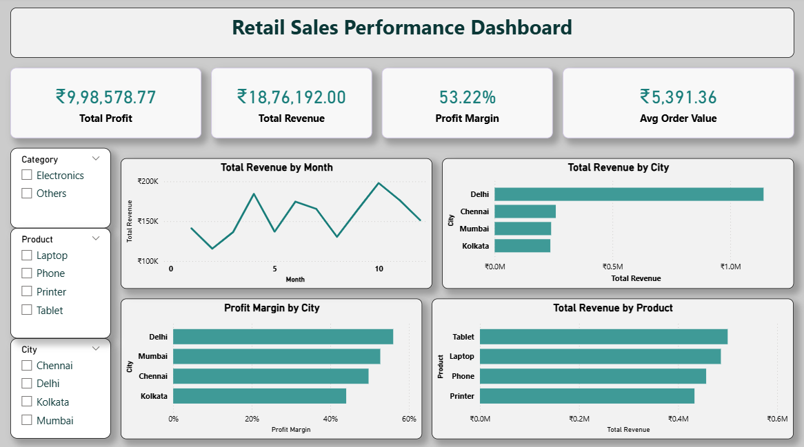

# 📊 Retail Sales Power BI Dashboard

## 🧠 Project Overview
This project is an end-to-end retail sales analytics project where I performed data cleaning in Python, validated data using SQL, and built an interactive Power BI dashboard to extract business insights.

The goal is to analyze revenue, profit, and customer behavior across different categories, cities, and products.

---

## 🔄 Project Workflow

### 1️⃣ Data Cleaning (Python - Google Colab)
- Imported raw retail sales dataset
- Removed inconsistent and invalid records
- Performed data type checks using `df.info()`
- Generated statistical summary using `df.describe()`
- Final cleaned dataset was exported for analysis

---

### 2️⃣ Data Validation & Exploration (SQL)
- Imported cleaned dataset from Python into SQL
- Performed queries to validate data consistency
- Analyzed revenue, profit, and order patterns
- Extracted key business insights from structured data

---

### 3️⃣ Data Visualization (Power BI Dashboard)
Built an interactive dashboard to visualize key business metrics and trends.

---

## 📊 KPI Cards
- 💰 Total Revenue  
- 📈 Total Profit  
- 📊 Profit Margin (%)  
- 🧾 Average Order Value (AOV)  

---

## 📈 Charts Used

- 📉 Total Revenue by Month (Line Chart)  
- 🏙 Total Revenue by City (Bar Chart)  
- 📊 Profit Margin by City (Bar Chart)  
- 📦 Total Revenue by Product (Bar Chart)  

---

## 🎛️ Slicers Used
- Category  
- City  
- Product  

---

📊 Key Insights

- Generated a Total Revenue of ₹18,76,192 with a Total Profit of ₹9,98,578.77, reflecting a strong Profit Margin of 53.22%
- Average Order Value (AOV) stood at ₹5,391.36
- Delhi emerged as the top-performing city, generating the highest revenue — nearly double that of the next closest city (Chennai)
- Delhi also led in profit margin, followed by Mumbai, Chennai, and Kolkata
- Tablets were the highest revenue-generating product, followed closely by Laptops, Phones, and Printers
- Monthly revenue showed clear fluctuations with a peak around month 10–11, indicating seasonal demand spikes
---

## 🛠 Tools & Technologies
- Python (Pandas) for Data Cleaning  
- SQL for Data Validation & Analysis  
- Power BI for Data Visualization  
- Google Colab for Python Execution
---

## Project Structure
- `python/data_cleaning.ipynb` — Python data cleaning
- `data/cleaned_retail_sales.csv` — Cleaned dataset
- `sql/retails_analysis.sql` — SQL validation & analysis queries
- `powerbi/retail sales analysis dashboard.pbix` — Power BI dashboard file
- `powerbi/Dashboard_Preview.png` — Dashboard screenshot
---

## How to Reproduce
1. Clone or download this repository
2. Open `python/data_cleaning.ipynb` in Jupyter Notebook or Google Colab to view the data cleaning steps
3. Import `data/cleaned_retail_sales.csv` into your SQL tool and run `sql/retails_analysis.sql` to reproduce the validation queries
4. Open `powerbi/retail sales analysis dashboard.pbix` in Power BI Desktop to explore the interactive dashboard
---

## 🚀 Key Learning Outcome
This project helped me understand the complete data analytics pipeline — from raw data cleaning to generating business insights through visualization tools.
