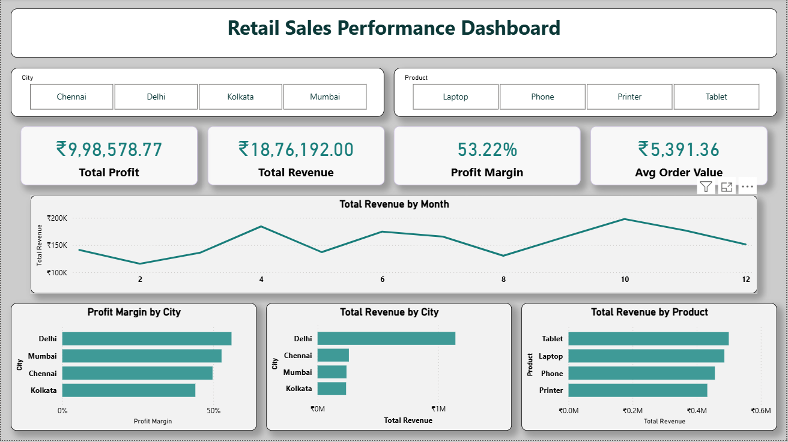

# 📊 Retail Sales Power BI Dashboard



## Project Overview

An end-to-end retail sales analytics project: data cleaning in Python, validation and business queries in SQL, and an interactive Power BI dashboard to surface revenue, profit, and product/city performance.

**Data note:** the source file (`retail_sales_practice.csv`) is a practice/synthetic dataset, not real transaction data. Profit margins here (~53%) are well above real-world retail norms (typically 5–20%) — this is disclosed here rather than adjusted, since altering the underlying numbers to look "more realistic" would misrepresent the data just as much as ignoring the issue would. Treat this as a demonstration of the analytics workflow, not a real business finding.

---

## Project Workflow

### 1. Data Cleaning (Python — Google Colab)

- Loaded the raw dataset (505 rows) and inspected types, nulls, and value ranges
- Removed 1 row with missing `Sales` (no reliable way to impute revenue)
- Removed 90 rows where `Quantity = 0` but `Sales > 0` — a logical impossibility
- Removed 62 rows where `Profit > Sales` — also impossible for a physical product sale
- Removed 4 exact duplicate rows
- Standardized `City` (fixed casing, whitespace, and a `Dehli` → `Delhi` typo)
- Converted `Discount` from a percentage (5, 10, 15) to a fraction (0.05, 0.10, 0.15)
- Imputed missing `Category` as `"Electronics"` — every product in the dataset (Tablet, Phone, Laptop, Printer) is confirmed to be electronics, so a missing label is missing metadata, not a separate business segment
- **Net result: 505 → 348 rows (31.1% dropped), fully logged with reasoning at each step**

### 2. Data Validation & Exploration (SQL)

- Loaded the cleaned dataset into MySQL
- Validated row count, checked for zero-`Sales` rows and duplicate `Order_ID`s
- Standardized every margin calculation to `SUM(Profit) / SUM(Sales)` (revenue-weighted), matching the Power BI measure exactly — confirmed both return the same 53.22% overall margin
- Queried revenue, profit, and margin by city and by product; drilled into Kolkata and Tablet performance specifically

### 3. Data Visualization (Power BI Dashboard)

Built an interactive dashboard on top of the cleaned CSV, filterable by City and Product.

---

## KPI Cards

- 💰 Total Revenue
- 📈 Total Profit
- 📊 Profit Margin (%)
- 🧾 Average Order Value (AOV)

## Charts Used

- Total Revenue by Month (Line Chart)
- Total Revenue by City (Bar Chart)
- Profit Margin by City (Bar Chart)
- Total Revenue by Product (Bar Chart)

## Slicers Used

- **Product**
- **City**

*(A Category slicer was removed — every row in the cleaned dataset is `Electronics`, so it had nothing to filter.)*

---

## Key Insights

- Generated Total Revenue of ₹18,76,192.00 with Total Profit of ₹9,98,578.77 — a 53.22% Profit Margin (see data note above on why this is high)
- Average Order Value stood at ₹5,391.36
- **Delhi** is the top-performing city by both revenue and profit margin (56.0%), followed by Mumbai (52.7%), Chennai (49.7%), and Kolkata (44.1%)
- **Tablets** generated the most revenue, followed closely by Laptops, Phones, and Printers
- Monthly revenue shows two distinct peaks — around month 4–5 and again around month 10–11 — with a dip in between, rather than a single seasonal spike

---

## Tools & Technologies

- Python (Pandas) for data cleaning — Google Colab
- SQL (MySQL) for validation & analysis
- Power BI for visualization

---

## Project Structure

```
├── python/data_cleaning.ipynb              — Python data cleaning (fully re-runnable, top to bottom)
├── data/retail_sales_practice.csv          — Raw dataset
├── data/cleaned_retail_sales.csv           — Cleaned dataset (348 rows)
├── sql/retail_analysis.sql                 — SQL validation & analysis queries
├── powerbi/retail_sales_analysis_dashboard.pbix — Power BI dashboard file
├── powerbi/Dashboard_Preview.png           — Dashboard screenshot
└── README.md
```

---

## How to Reproduce

1. Clone or download this repository
2. Open `python/data_cleaning.ipynb` in Jupyter or Google Colab and run all cells top to bottom to regenerate `cleaned_retail_sales.csv`
3. In MySQL Workbench: run the setup portion of `sql/retail_analysis.sql` (`CREATE DATABASE` → `CREATE TABLE`), then use the **Table Data Import Wizard** (right-click `retail_sales` → Table Data Import Wizard) to load `cleaned_retail_sales.csv` into the existing table — the file's own `LOAD DATA LOCAL INFILE` line is commented out since it requires extra server permissions most setups don't have enabled by default
4. Run the remaining validation and analysis queries in `sql/retail_analysis.sql`
5. Open `powerbi/retail_sales_analysis_dashboard.pbix` in Power BI Desktop. If the data source shows an error on open, go to **Transform Data → Applied Steps → Source (gear icon)** and repoint it to your local copy of `cleaned_retail_sales.csv`, then **Close & Apply**

---

## Key Learning Outcomes

This project covers the full analytics pipeline — raw data cleaning, SQL validation, and dashboard visualization — and, just as importantly, the debugging process behind it: catching an out-of-order notebook execution artifact, correcting a mislabeled category from imputation, standardizing an inconsistent metric formula across two tools, and verifying (rather than assuming) how a chart's axis settings actually affect what gets rendered.
